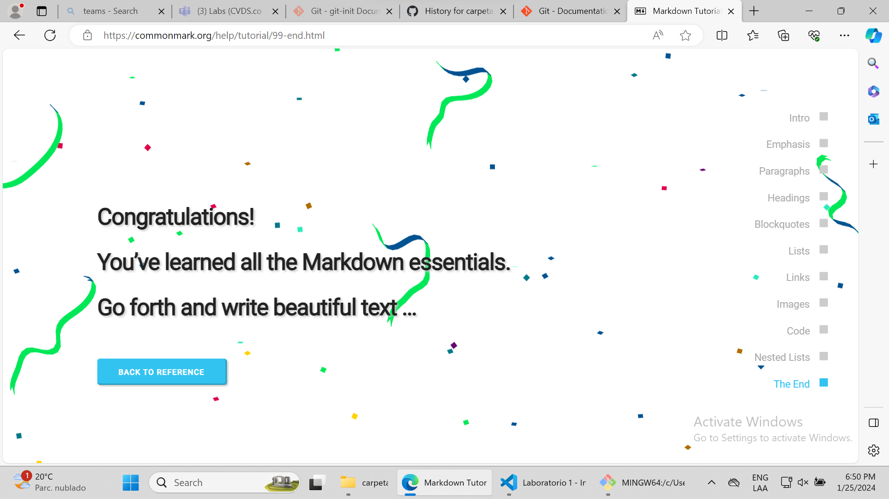
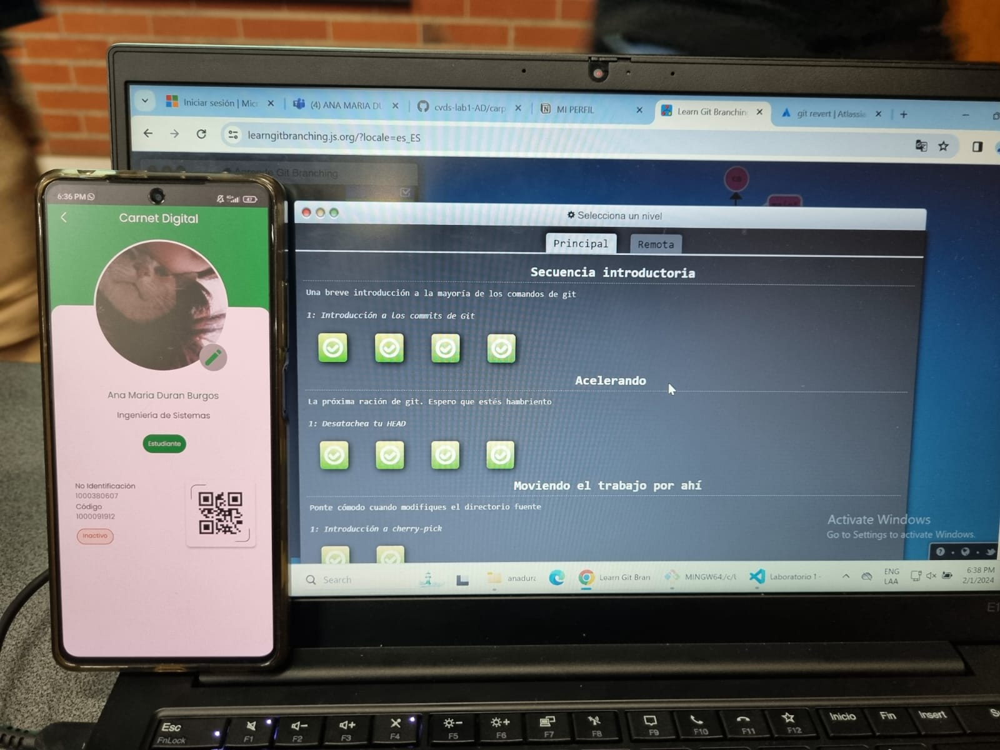
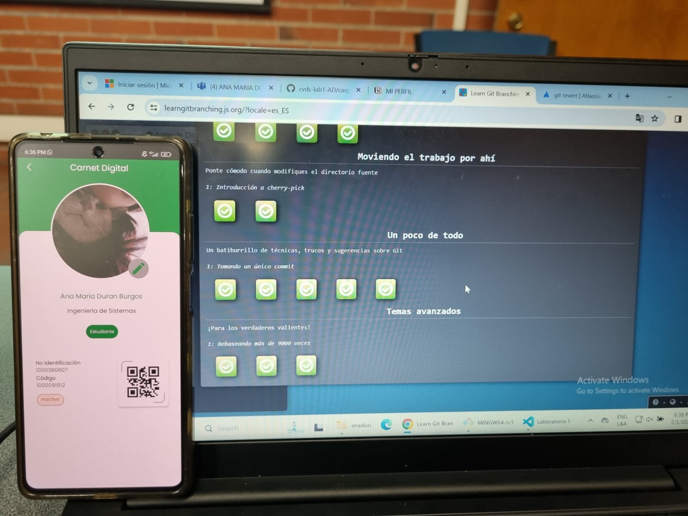
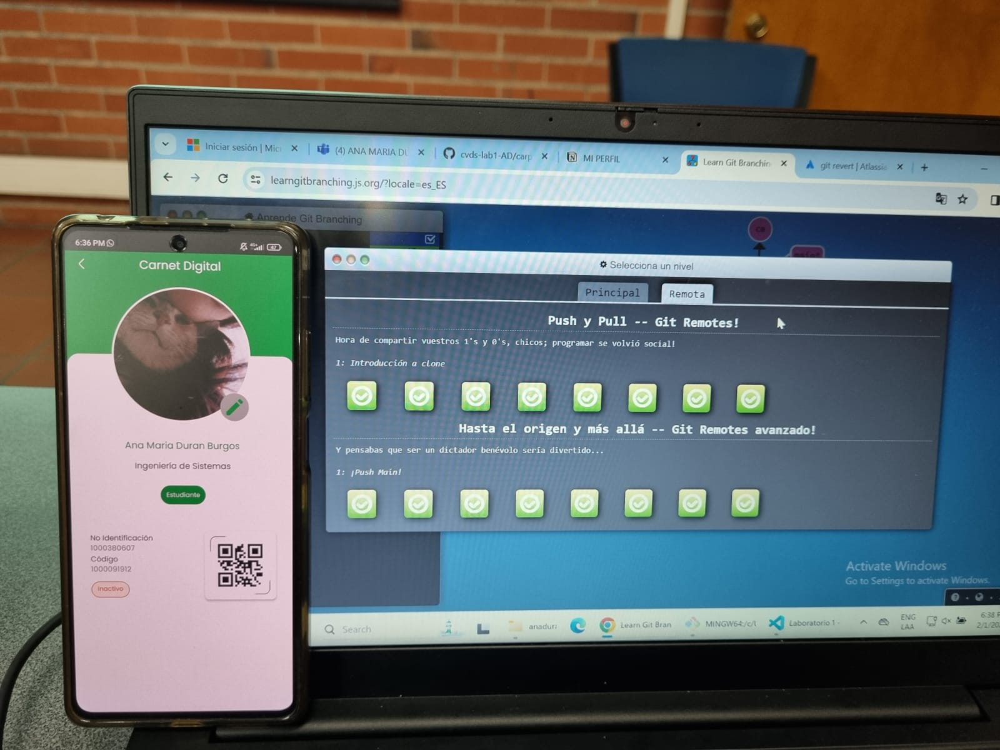

# MI PERFIL

## Datos básica

**Nombre**: Ana Maria Duran Burgos

**Ciudad natal:** Bogotá

**Fecha de nacimiento**: 28/09/2003

**Plan de estudios**: Ingeniería de Sistemas, *séptimo semestre*, Universidad Escuela Colombiana de Ingeniería Julio Garavito.

Me gustan mucho los animales pero en especial los gatitos!


Tengo experiencia desarrollando en java, y además, me interesa mucho el desarrollo web y el ux y ui design. Me gusta el diseño y actualmente me encuentro haciendo el diseño de mi portafolio de página web, lo chistoso es que no tengo muchos conocimientos sobre este tema peeero espero aprenderlo pronto jeje. Me gusta jugar valorant con mi amigos y salir a comer con mi familia y seres queridos.

Mis conocimientos en javascript se limitan a:

```jsx
console.log("Hello, world!")
```

El vídeo que más me da risa de youtube es https://youtu.be/m92lHLeYTY8?si=Su2AESJnOu_LTo1O :D

Mi youtuber favorita es [Ter](https://www.youtube.com/@Ter)!!

### Marckdown tutorial



### Receta
Una receta para hacer la **pasta alfredo**:

1. comprar la pasta (indispensable) y pollo
2. picar el pollo en cuadritos y sazonar, fritar en una paila
3. hervir la pasta (no opcional)
4. comprar:
    1. ajo
    2. harina de trigo
    3. mantequilla
    4. nuez moscada
    5. queso para derretir
    6. leche
5. poner la mantequilla en la olla con el ajo picado, minutos despues agregar la harina, revolver.
6. agregar la leche y seguir revolviendo, agregar la nuez moscada (un poco)
7. agregar el queso rallado
8. poner la pasta en la olla
9. agregar el pollo a la pasta
10. servir :D

## Pantallazos:

### Principal



### Remota

